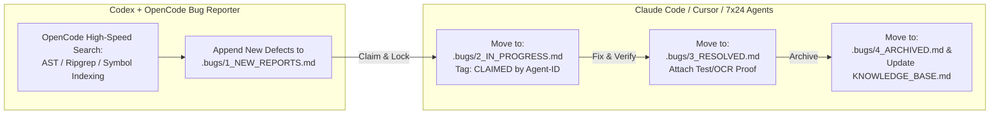

# Autonomous Maintenance, Cross-Repository Interaction & Project Evolution Workflow (Tri-Repo Ecosystem)

---
### 馃И MANDATORY TESTING METHODOLOGY: THE PRE-CONFIGURED 3-TIER SUITE
When testing, building, or verifying any modification, **YOU MUST STRICTLY USE THE PRE-CONFIGURED 3-TIER TESTING SUITE** defined in:
馃憠 i/CANONICAL_TESTING_AND_VERIFICATION_SUITE.md

This enforces:
1. **Tier 1 (Automated AST/Test Gate)**: dotnet test / cargo test / go test -race / pytest / strict build -warnaserror.
2. **Tier 2 (Live Debug Trace Trap)**: Attached WPF DataBinding TraceListener Level=Warning & Task.Run WMI 2500ms timeout traps.
3. **Tier 3 (5-Locale x 3-DPI Multimodal OCR Matrix)**: Quantified verification against [UI-OCR-Clipping], [UI-OCR-Mojibake], [UI-OCR-Collision], and [UI-OCR-Contrast] across 100% / 125% / 150% DPI and en / zh-Hans / ja / de / ru.
(For Novel, use the pre-configured Literary Continuity & Repetition Pruning Audit loop defined in CANONICAL_TESTING_AND_VERIFICATION_SUITE.md).
---

This document establishes the authoritative, long-term (decade-scale) autonomous workflow for AI agents and human maintainers managing our **Tri-Repo Ecosystem**:
1. **Universal Device Toolkit** (`D:\EliuaK_Csy\Working-Paper\My-Program\UniversalDeviceToolkit\`) - Main Host Application & SDK.
2. **UniversalDeviceToolkit-Plugins** (`D:\EliuaK_Csy\Working-Paper\My-Program\UniversalDeviceToolkit-Plugins\`) - Plugin Extensions & UI Marketplace.
3. **Veser** (`D:\EliuaK_Csy\Working-Paper\My-Program\Veser\`) - Dual-Engine AI Productivity Software (QCoder & WorkBuddy, Tauri/Rust/TS, Commercial Gateway).

By standardising **Multi-Document Bug Tracking & Concurrency Control**, **Codex + OpenCode High-Speed Inspection**, **Cross-Repository Synchronization**, **7脳24H Endless Iteration**, **Session Handover & Knowledge Accumulation**, and **Dual-Track Verification**, this workflow ensures that any AI agent can step into any repository at any point in time without race conditions or status conflicts.

---

## 馃殌 1. The One-Prompt Trigger (涓€閿Е鍙戝彛浠ょ煩闃?

To initiate autonomous maintenance, feature addition, bug fixing, or cross-repository synchronization, provide the appropriate instruction to any AI agent (Claude Code, Cursor, Codex, Agent CLI):

> **For UniversalDeviceToolkit (Main Repo)**:
> *"Read `D:\EliuaK_Csy\Working-Paper\My-Program\UniversalDeviceToolkit\AUTONOMOUS_MAINTENANCE_AND_EVOLUTION_WORKFLOW.md` and execute autonomous project maintenance, .bugs/ queue resolution, cross-repo sync, feature evolution, and 100+ Star promotion."*

> **For UniversalDeviceToolkit-Plugins (Plugin Repo)**:
> *"Read `D:\EliuaK_Csy\Working-Paper\My-Program\UniversalDeviceToolkit-Plugins\AUTONOMOUS_MAINTENANCE_AND_EVOLUTION_WORKFLOW.md` and execute autonomous plugin UI redesign, .bugs/ queue resolution, cross-repo sync, and 100+ Star store promotion."*

> **For Veser (Dual-Engine AI Productivity Software)**:
> *"Read `D:\EliuaK_Csy\Working-Paper\My-Program\Veser\AUTONOMOUS_MAINTENANCE_AND_EVOLUTION_WORKFLOW.md` and execute 7脳24H continuous autonomous workflow: API harvesting, UI/performance tuning, .bugs/ queue resolution, E2E testing, ssh veser deployment, and commercial gateway optimization."*

---

## 馃毃 2. Priority 1: Multi-Document Bug Queue & Concurrency Control (澶氭枃妗ｅ苟鍙戞帶鍒朵笌鐘舵€侀殧绂?

Because multiple AI agents (**Codex + OpenCode Bug Reporter** and **Claude Code / Cursor Maintenance Agents**) run simultaneously across all three repositories, reading and writing to a single `BUG.md` file causes write collisions, race conditions, and duplicate work. 

To solve this, all three repositories use a **Multi-Document Bug Tracking Queue (`.bugs/` directory)** that separates bug lifecycles into 4 distinct, atomic state ledgers:

### A. The 4-Stage Multi-Document Queue (`.bugs/`)
1. **`.bugs/1_NEW_REPORTS.md` (New & Unassigned)**: Written exclusively by **Codex + OpenCode Bug Reporter**. Holds newly discovered defects, stack traces, and architectural violations.
2. **`.bugs/2_IN_PROGRESS.md` (Claimed & Locked / Atomic Mutex)**: When a maintenance agent picks a bug from `1_NEW_REPORTS.md`, it immediately cuts and pastes the ticket into `2_IN_PROGRESS.md`, tagging it with `[CLAIMED by <Agent-ID> at <Timestamp>]`. This acts as an **atomic lock** preventing concurrent duplicate work!
3. **`.bugs/3_RESOLVED.md` (Fixed & Verification Attached)**: When the code/XAML fix is complete and passes verification (Unit tests, OCR check, or Veser E2E assert_cmd), the agent moves the ticket here.
4. **`.bugs/4_ARCHIVED.md` (Archived & Knowledge Ingested)**: Final closed state. The root cause and preventative rule are permanently transcribed into `KNOWLEDGE_BASE.md`.

---

## 鈿?3. Codex + OpenCode High-Speed Inspection Architecture (Codex 瀹夸富 + OpenCode 鏋侀€熸绱?

The Bug Reporter runs inside **Codex** (for long-term orchestrator reasoning and state memory) but invokes **OpenCode** as its high-speed AST and codebase search engine across all 3 repositories:
- **Speed & Precision**: OpenCode instantly locates `.ConfigureAwait(false)` violations, synchronous WMI queries, hardcoded hex colors, unlocalized strings, Rust `.unwrap()` violations, or non-strict TypeScript types without loading every file into LLM memory!

---

## 鈴?4. Decade-Scale Maintenance, Handover & Knowledge Accumulation (闀挎湡杩愯涓庝氦鎺?

### A. The Living Knowledge Ledger (`KNOWLEDGE_BASE.md`)
Every time an item reaches `.bugs/4_ARCHIVED.md`, the agent must append a structured entry to `KNOWLEDGE_BASE.md` in the respective repository root:
- **Timestamp & Version**: When and under what .NET / Rust / Node / OS version the lesson was learned.
- **Symptom / Pitfall**: What failed (e.g., `"InvalidOperationException during plugin download"` or `"Tauri IPC memory overflow over 300MB"`).
- **Root Cause**: Why it failed (e.g., `"ConfigureAwait(false) stripped WPF SynchronizationContext"` or `"Binary stream unchunked"`).
- **Enforced Rule**: What mandatory constraint prevents recursion (e.g., `"Always use Dispatcher.InvokeAsync()"` or `"Use 16ms chunked binary channels"`).

### B. The 4-Step Handover Protocol (浜ゆ帴鍥涙娉?
When an AI agent approaches its context window limit or finishes a task:
1. **Update Queue Ledgers**: Move claimed items in `.bugs/2_IN_PROGRESS.md` to `3_RESOLVED.md` or release back to `1_NEW_REPORTS.md`.
2. **Update Task Ledgers**: Mark completed items in `TASK.md`, `WALKTHROUGH.md`, or `Veser_Production_and_E2E_Report.md`.
3. **Update Release Changelogs**: Append user-visible changes to `CHANGELOG.md`.
4. **Verify Git Cleanliness**: Ensure `dotnet build` or `cargo test` returns 0 errors. Emit a clean handover summary for the next agent session!

---

## 馃攧 5. Cross-Repository Interaction & Tri-Repo Synergy (涓夊簱璺ㄥ簱鍗忓悓)

1. **Main Repo <-> Plugin Repo**: When `UniversalDeviceToolkit.Lib.Plugins` or WPF theme resources change in Main, immediately run `.\llt-plugin.cmd build` in `UniversalDeviceToolkit-Plugins` to verify compatibility. Promote manifests via `.\llt-plugin.cmd promote` and ingest via `generate-store`.
2. **Veser <-> Main Repo Synergy**: Veser's developer module (**QCoder**) can be leveraged as an automated code-repair engine to inspect and propose patches for `UniversalDeviceToolkit` bugs! When Veser's Rust CLI (`veser.exe`) updates its system diagnostics, relevant WMI/hardware optimization rules are cross-pollinated into the Main Toolkit's `KNOWLEDGE_BASE.md`.

---

## 馃洜锔?6. Feature Evolution & Domain-Specific Pillars (鍚勫簱鍔熻兘杩涢樁閾佸緥)

### A. UniversalDeviceToolkit & Plugins Pillars
1. **WPF Thread Safety**: Zero `.ConfigureAwait(false)` in UI/ViewModels. Guard repaints via `Dispatcher.InvokeAsync()`.
2. **WMI Async Timeouts**: Wrap all WMI queries and administrative calls (`netsh`, `sc`) in strict 2,500ms timeouts.
3. **Modular UI & Design Token Binding**: Rounded cards (`CornerRadius="8"`), responsive layouts (`Grid` star-sizing, `WrapPanel`), and 100% host theme brush binding (`ControlFillColorDefaultBrush`).
4. **Localization & OCR Check**: Zero hardcoded strings. Extract to `Resource.resx`. Verify via FlaUI + WinRT OCR across 78+ locales.

### B. Veser 7脳24H Continuous Evolution Pillars
1. **Rust / TypeScript Strict Governance**: Zero `.unwrap()` in production Rust; use `thiserror` + `anyhow`; pass `cargo fmt` and `clippy`. Strict TS compilation. Frontend never calls OS commands directly; always use Rust CLI (`cli/ - veser.exe`) JSON-RPC.
2. **Dark Aesthetic & 60 FPS Performance**: Deep porcelain black (`#0B0F17` / Slate-950), QCoder cyan (`#2DD4BF`), WorkBuddy titanium purple, 1px linear glow borders, Shimmer Glow text. TanStack Virtual for 10k+ logs/diffs (60 FPS). Lazy load (<2MB bundle, <0.8s cold start). Tauri binary IPC chunking (<300MB RAM).
3. **API Harvesting & `ssh veser` Deployment**: Harvest local API keys from IDE configs or auto-register free tiers (SiliconFlow, DeepSeek, Aliyun Bailian, Volcengine). Verify via E2E (`node scripts/veser-e2e-test.mjs` and Rust `assert_cmd`). When pass rate >90%, execute `ssh veser` directly to deploy to production server! (Auto-repair `~/.ssh/config` via browser SQLite if SSH fails).
4. **Commercial Gateway Optimization**: Route domestic queries to legal models (DeepSeek-V4). Enforce prompt caching for KV cache hit rate $\ge 75\%$, TTFT <400ms, targeting 楼480 net profit/Pro user.

