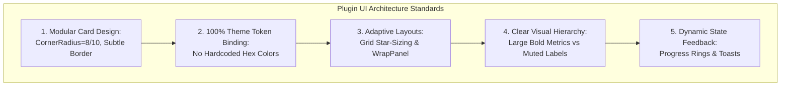
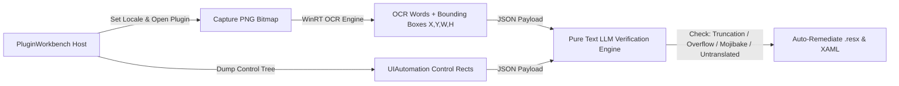

# Plugin UI/UX Design Standards, Engineering Governance & Verification Plan

---
### 馃И MANDATORY TESTING METHODOLOGY: THE PRE-CONFIGURED 3-TIER SUITE
When testing, building, or verifying any modification, **YOU MUST STRICTLY USE THE PRE-CONFIGURED 3-TIER TESTING SUITE** defined in:
馃憠 i/CANONICAL_TESTING_AND_VERIFICATION_SUITE.md

This enforces:
1. **Tier 1 (Automated AST/Test Gate)**: dotnet test / cargo test / go test -race / pytest / strict build -warnaserror.
2. **Tier 2 (Live Debug Trace Trap)**: Attached WPF DataBinding TraceListener Level=Warning & Task.Run WMI 2500ms timeout traps.
3. **Tier 3 (5-Locale x 3-DPI Multimodal OCR Matrix)**: Quantified verification against [UI-OCR-Clipping], [UI-OCR-Mojibake], [UI-OCR-Collision], and [UI-OCR-Contrast] across 100% / 125% / 150% DPI and en / zh-Hans / ja / de / ru.
(For Novel, use the pre-configured Literary Continuity & Repetition Pruning Audit loop defined in CANONICAL_TESTING_AND_VERIFICATION_SUITE.md).
---

This document establishes the mandatory UI/UX design specifications, architectural constraints, localization rules, OCR verification pipeline, and open-source marketing standards for all plugins developed within the **UniversalDeviceToolkit-Plugins** repository. 

Our goal is to elevate plugin development from fragmented, ad-hoc scripts into a premium, state-of-the-art ecosystem that seamlessly matches the visual excellence and rock-solid stability of the host Universal Device Toolkit application.

---

## 1. Plugin UI/UX Design Standards & Refactoring Guidelines (鎻掍欢 UI/UX 寮虹害鏉熶笌璁捐瑙勮寖)

### A. Case Study: Why Legacy Plugin UIs Failed (涓轰粈涔堥儴鍒嗘棫鐗堟彃浠?UI 鈥滃仛寰楄窡灞庝竴鏍封€?
An analysis of legacy plugins鈥攕pecifically the **Network Acceleration (`NetworkAccelerationControl.xaml`)** plugin鈥攔eveals critical UI/UX flaws that must be strictly eradicated across all plugins:
1. **Monolithic Clutter & Lack of Information Hierarchy (鍗曢〉鏃犺剳鍫嗙爩涓庡眰绾ф贩涔?**:
   - *The Flaw*: `NetworkAccelerationControl.xaml` spans over 600 lines, dumping hero status banners, mode selection cards, live telemetry metrics, quick optimization plans, and behavior toggles vertically into a single scrolling `StackPanel`. Users are greeted by a wall of text and boxes without visual breathing room or clear operational focus.
   - *The Fix*: **Modular Tabs & Visual Cards**. Separate operational monitoring (Dashboard/Status) from configuration rules (Settings/Advanced) using WPF UI `TabControl` or clean navigation pivots.
2. **Rigid Layouts, Hardcoded Margins & Broken Scaling (姝绘澘甯冨眬涓庤嚜閫傚簲澶辨晥)**:
   - *The Flaw*: Using rigid fixed widths (`Width="40"`), hardcoded pixel padding/margins (`Margin="0,0,18,4"`), and inflexible stack panels. When window sizes change or users run on high-DPI 4K displays with 150%+ scaling, elements clip, text truncates, and alignment breaks awkwardly.
   - *The Fix*: **Responsive Grid & Star Sizing**. Use adaptive WPF layout containers (`Grid` with `Width="*"`, `UniformGrid`, `WrapPanel` with dynamic `MinWidth`) and strictly bind to global design system spacing tokens.
3. **Poor Telemetry Presentation (鐩戞帶鏁版嵁灞曠ず绮楃硻)**:
   - *The Flaw*: Live network speeds (Download/Upload Mbps, peak traffic, adapter status) are rendered as plain, uninspired text lines inside nested stack panels, making vital real-time data hard to read at a glance.
   - *The Fix*: **Prominent Metric Cards & Visual Sparklines**. Present real-time telemetry inside dedicated visual cards featuring large, bold typography for numerical values, muted secondary typography for units/labels, and smooth status badges.
4. **Absence of Interactive Polish & Micro-Animations (缂轰箯浜や簰鍙嶉涓庡井鍔ㄧ敾)**:
   - *The Flaw*: Clicking "Run Quick Optimization" or switching network profiles abruptly swaps text strings or blocks UI rendering without visual progress feedback.
   - *The Fix*: **Dynamic State Transitions**. Incorporate smooth progress rings during network stack resets, subtle hover glow effects on selectable mode cards, and clean toast notifications upon action completion.

---

### B. Mandatory Plugin UI Design Specifications (鎻掍欢鐣岄潰寮€鍙戝崄浜屾潯閾佸緥)

1. **Adhere strictly to Host Design System Tokens**: Never hardcode colors (like `#FFFFFF` or `#333333`) or rigid brushes in plugin XAML. Always bind dynamically to host WPF UI resources:
   - Backgrounds: `{DynamicResource ControlFillColorDefaultBrush}`, `{DynamicResource ControlFillColorSecondaryBrush}`
   - Borders: `{DynamicResource ControlStrokeColorDefaultBrush}`
   - Text: `{DynamicResource TextFillColorPrimaryBrush}`, `{DynamicResource TextFillColorSecondaryBrush}`
   - Accents: `{DynamicResource SystemAccentColorPrimaryBrush}`
2. **Standardize Card Geometry**: All feature containers and settings blocks must use rounded `Border` cards with `CornerRadius="8"` or `"10"`, `BorderThickness="1"`, and standard padding (`16px, 14px`).
3. **Limit Vertical Scroll Length**: If a plugin control exceeds 2 screens of vertical height, you MUST split the interface into logical sub-views or tabs (e.g., `Overview`, `Optimization Rules`, `Settings`).
4. **Empty & Loading States**: When telemetry is initializing or no active network adapter is found, display a beautifully designed empty/loading state card with a helpful description and retry button鈥攏ever leave blank spaces or ugly `null` labels!

---

## 2. Architectural & Threading Governance (鏍稿績搴曞眰涓庡绾跨▼寮虹害鏉?

Just like the main application, all plugin codebase contributions must strictly follow our core stability constraints:

### A. WPF UI Thread Affinity & Zero `.ConfigureAwait(false)` (UI 绾跨▼瀹夊叏)
- **Never use `.ConfigureAwait(false)` in Plugin UI/ViewModel Code**: Stripping the synchronization context in plugin controls guarantees `InvalidOperationException` crashes when background downloaders or telemetry timers fire.
- **Defensive Dispatcher Marshaling**: When background services (such as `NetworkAccelerationRuntime` or WMI network adapter monitoring) trigger events (`StateChanged`, `TrafficUpdated`), always marshal UI repaints via `Dispatcher.CheckAccess()` and `Dispatcher.InvokeAsync()`.
- **Safe Process Execution & Teardown**: Network optimization plugins frequently invoke system utilities (`netsh`, `ipconfig`, Winsock resets, DNS flushes). All external process calls must use asynchronous wrappers with cancellation tokens and clean exit-code verification.

### B. Zero-Spam Polling & Low Background Footprint (闆跺啑浣欑洃鎺т笌鏋佽嚧杞婚噺)
- **No Per-Poll Disk Logging**: Network telemetry loops running every 1鈥? seconds must **never** emit trace logs or serialize JSON data on every tick.
- **Resource Cleanup on Unload**: When a plugin tab is closed or unloaded (`UserControl_Unloaded`), explicitly stop background monitoring timers and unsubscribe from static event handlers to prevent memory leaks.

---

## 3. Localization & Pure Text LLM OCR Verification (澶氳瑷€涓?OCR 绾枃鏈ぇ妯″瀷璐ㄦ)

Plugins must support international users and participate in our **Automated OCR & Pure Text LLM Translation Verification Pipeline**:

### A. Eradication of Hardcoded Strings in Plugins (鎻掍欢鏉滅粷纭紪鐮佹枃妗?
- All user-facing text in plugin XAML and C# (including button labels, tooltips, status messages, and error hints) must be extracted into the plugin's local `Resources/Resource.resx` file.
- Use numbered placeholders (`{0}`, `{1}`) with `string.Format(CultureInfo.CurrentCulture, ...)` instead of string concatenation.

### B. Automated 5-Dimension Verification Pipeline (鎻掍欢 UI 浜旂淮鑷姩鍖栬川妫€)
When a plugin is built and validated, our automated UI test driver (`FlaUI` + `PluginWorkbench`) launches the plugin across priority locales (`zh-Hans`, `zh-Hant`, `de`, `es`, `ja`, `fr`, `ru`).

The **Pure Text LLM Verification Engine** evaluates the mapped OCR coordinate data against UIAutomation bounding boxes using 5 strict rules:
1. **Untranslated Detection**: Flagging English fallback text appearing in non-English locales.
2. **Mojibake & Encoding**: Flagging corrupted UTF-8/UTF-16 characters or replacement boxes (`鈻).
3. **Broken Placeholders**: Flagging unreplaced format tags (`{0}`, `{1}`) or raw data bindings.
4. **Layout Truncation & Box Overflow**: Comparing OCR text bounding widths against UI container widths. If OCR text ends in ellipses (`...`) or `width >= control_bounds.width * 0.98`, the system automatically flags and modifies the XAML layout (enabling `TextWrapping="Wrap"`, `TextTrimming="CharacterEllipsis"`, or changing fixed widths to dynamic `MinWidth`).
5. **Technical Domain Semantics**: Verifying accurate hardware and network terminology (e.g., translating "Winsock Reset", "DNS Flush", "TCP/IP Stack", "MUX Switch" accurately without literal machine-translation errors).

---

## 4. Open Source Promotion & Marketing Governance (鎻掍欢浠撳簱瀹ｄ紶鎺ㄥ箍涓庝笂鏋惰鑼?

When promoting individual plugins or releasing updates to the official plugin store (`store-entry.json`), all contributors and AI agents must follow ethical marketing guidelines:

### A. Key Promotion Channels (鏍稿績瀹ｄ紶娓犻亾)
- **Global Developer & Gaming Communities**: GitHub Releases/Discussions, Reddit (`r/LenovoLegion`, `r/GamingLaptops`, `r/windows`), Discord tech channels.
- **Chinese Geek & Tech Communities (鍥藉唴鏍稿績鏋佸绀惧尯)**: 鍚剧埍鐮磋В (52Poje)銆乂2EX銆丆hiphell (CHH)銆丅绔欑鎶€鍖哄紑婧愭帹鑽愩€佺煡涔庣‖浠惰皟浼樹笓鏍忋€佺櫨搴﹁创鍚э紙鎷晳鑰呭惂銆佹樉鍗″惂銆佹瀬瀹㈠惂锛夈€佸皬绾功鐢佃剳瀹炵敤宸ュ叿鍒嗕韩銆?
### B. Copywriting Elements & Constraints (瀹ｄ紶鏂囨榛勯噾瑕佺礌涓庡簳绾跨害鏉?
1. **The Hook / Pain Point**: Why use this plugin? (e.g., *"Windows default DNS caching and bloated third-party game boosters consume 200MB+ RAM and run background tracking service. Our Network Acceleration plugin provides pure, 1-click system-level network stack optimization directly inside your toolkit."*)
2. **Truthful & Evidence-Based (涓ュ畧浜嬪疄锛岀粷涓嶈櫄鍋囧じ澶?**:
   - **Never** make baseless claims like *"Lowers your gaming ping by 100ms"* or *"Guarantees zero packet loss"*.
   - Use technical, accurate descriptions: *"Optimizes Windows TCP/IP stack parameters, flushes DNS cache, and resets Winsock catalog to eliminate local socket bottlenecks without running background VPN or proxy daemons."*
3. **Security & Transparency**: Emphasize that all plugin code is 100% open-source, auditable on GitHub, contains zero telemetry, zero adware, and executes standard Windows network administrative commands cleanly.

---

## 5. Summary Checklist for Plugin Contributors

Before submitting a pull request or promoting an official plugin release:
- [ ] **UI Polish**: Does the XAML use modular cards (`CornerRadius="8"`), responsive sizing (`Width="*"`, `MinWidth`), and host theme brushes without hardcoded hex colors?
- [ ] **Thread Safety**: Have all `.ConfigureAwait(false)` calls been removed from UI/ViewModel paths, and are background UI updates marshaled via `Dispatcher.InvokeAsync()`?
- [ ] **Localization**: Are all user-facing strings extracted to `Resource.resx` without string concatenation?
- [ ] **OCR Verification**: Has the plugin been tested in `PluginWorkbench` under non-English locales to ensure zero text clipping or layout overflow?
- [ ] **Marketing Copy**: Does the store description and release notes adhere to truthful, evidence-based copywriting without exaggerated claims?

